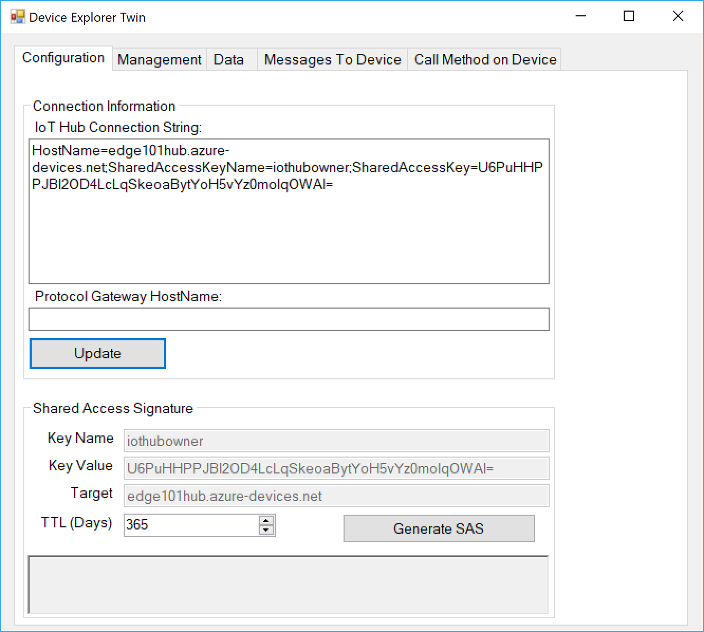
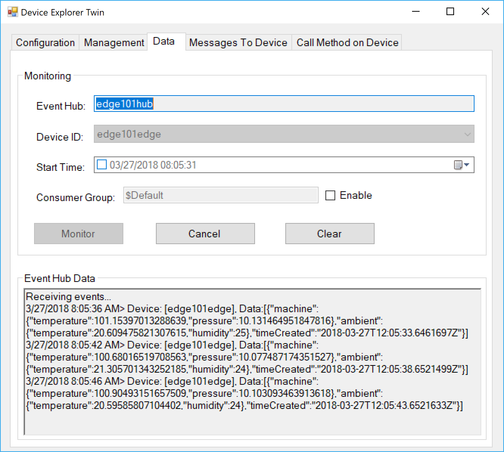

# Azure IoT Edge 101 

Getting Started with Azure IoT Edge v1. 

## Ensure Pre-reqs:

1. You will need:

  - [Visual Studio Code](https://code.visualstudio.com/)
  - [Azure IoT Edge extension for Visual Studio Code.](https://marketplace.visualstudio.com/items?itemName=vsciot-vscode.azure-iot-edge)
  - [C# for Visual Studio Code (powered by OmniSharp extension.](https://marketplace.visualstudio.com/items?itemName=ms-vscode.csharp)
  - [Docker](https://docs.docker.com/engine/installation/) on the same computer that has Visual Studio Code. The Community Edition (CE) is sufficient for this tutorial.
  - [.NET Core 2.0 SDK](https://www.microsoft.com/net/core#windowscmd)
  - Install [Python 2.7 on Windows](https://www.python.org/downloads/) and make sure you can use the pip command
  - The Azure IoT Edge Runtime Control script:

    ```bash
    pip install -U azure-iot-edge-runtime-ctl
    ```

## Demos

- [Create an IoT Hub](#createiothub)
- [Configure Azure IoT Edge](#configureedge")
- [Simulated Temperature Module](#simulatedsensor)
- [Custom C# Filter Module](#custommodule)
- [Clean Up](#cleanup)


---

<a name="createiothub"></a>

## DEMO: Create an IoT Hub

These steps are taken generally, with some variation, from [Quickstart: Deploy your first IoT Edge module from the Azure portal to a Windows device - preview](https://docs.microsoft.com/en-us/azure/iot-edge/quickstart)

1. Run 

    ```bash
    az group create -g edge101group -l westus
    ```

2. Then

    ```bash
    az iot hub create -n edge101hub -g edge101group --sku S1
    ```

---

<a name="configureedge"></a>

## Configure Azure IoT Edge

1. Install the Azure IoT Runtime:

    ```bash
    pip install -U azure-iot-edge-runtime-ctl
    ```

1. Go to the [portal](https://portal.azure.com) and open the `edge101hub` you just created

1. On the left edge of the hub's blade, click on "**IoT Edge (preview)**", then on the top of that blade, click "**+ Add IoT Edge Device**" 

1. Give the new edge device an id, (`edge101edge`), leave all other fields at the defaults, and click "**Save**"

1. Once the new edge device ID is created, click on it's name, and copy it's "**Connection String - Primary**".  Save it for future use:

    ```text
    HostName=edge101hub.azure-devices.net;DeviceId=edge101edge;SharedAccessKey=qFo1k8DqPTQ0SL/j3zIW/Ma89WFaY2QZBw+Q2TQXYYw=
    ```

1. Run the following, passing in the connection string for the edge device you created previously:

    ```bash
    iotedgectl setup --connection-string "{device connection string}" --nopass
    ```

    For example:

    ```bash
    iotedgectl setup --connection-string "HostName=edge101hub.azure-devices.net;DeviceId=edge101edge;SharedAccessKey=qFo1k8DqPTQ0SL/j3zIW/Ma89WFaY2QZBw+Q2TQXYYw=" --nopass
    ```

1. Start the runtime

    ```bash
    iotedgectl start
    ```

1. And verify that the `edgeAgent` container is running:

    ```bash
    docker ps
    ```

    With output similar to:

    ```bash
    CONTAINER ID  IMAGE                                     ...  NAMES
    27cf5eefdcbf  microsoft/azureiotedge-agent:1.0-preview  ...  edgeAgent
    ``` 

1. Notice that there is only one module (container) running, `edgeAgent`. The `edgeHub` is NOT running because no modules have been specified so the `edgeHub` is not needed to broker the communication between them. 

1. View the logs fromt the `edgeAgent` module

    > **Note**: Keep the `edgeAgent` logs running in this terminal, and open another terminal for subsequent steps. That way we can monitor what is going on with the `edgeAgent` when we deploy the `tempSensor` module in the next step.

    ```bash
    docker logs -f edgeAgent
    ```

    With output similar to:

    ```bash
    2018-03-26 22:19:02.136 +00:00 [INF] - Starting module management agent.
    2018-03-26 22:19:02.336 +00:00 [INF] - Version - 1.0.0-preview021.10543704 (c87b52c93b13f03bf34da8d9ae650d55368ccecb)
    2018-03-26 22:19:02.337 +00:00 [INF] -
            █████╗ ███████╗██╗   ██╗██████╗ ███████╗
            ██╔══██╗╚══███╔╝██║   ██║██╔══██╗██╔════╝
            ███████║  ███╔╝ ██║   ██║██████╔╝█████╗
            ██╔══██║ ███╔╝  ██║   ██║██╔══██╗██╔══╝
            ██║  ██║███████╗╚██████╔╝██║  ██║███████╗
            ╚═╝  ╚═╝╚══════╝ ╚═════╝ ╚═╝  ╚═╝╚══════╝

    ██╗ ██████╗ ████████╗    ███████╗██████╗  ██████╗ ███████╗
    ██║██╔═══██╗╚══██╔══╝    ██╔════╝██╔══██╗██╔════╝ ██╔════╝
    ██║██║   ██║   ██║       █████╗  ██║  ██║██║  ███╗█████╗
    ██║██║   ██║   ██║       ██╔══╝  ██║  ██║██║   ██║██╔══╝
    ██║╚██████╔╝   ██║       ███████╗██████╔╝╚██████╔╝███████╗
    ╚═╝ ╚═════╝    ╚═╝       ╚══════╝╚═════╝  ╚═════╝ ╚══════╝

    2018-03-26 22:19:02.454 +00:00 [INF] - Edge agent attempting to connect to IoT Hub via AMQP...
    2018-03-26 22:19:03.287 +00:00 [INF] - Created persistent store at /tmp/edgeAgent
    2018-03-26 22:19:04.909 +00:00 [INF] - Edge agent connected to IoT Hub via AMQP.
    2018-03-26 22:19:05.377 +00:00 [INF] - Deployment config in edge agent's desired properties is empty.
    2018-03-26 22:19:05.391 +00:00 [ERR] - Error refreshing edge agent configuration from twin.
    Microsoft.Azure.Devices.Edge.Agent.Core.ConfigSources.ConfigEmptyException: This device has an empty configuration for the edge agent. Please set a deployment manifest.
        at Microsoft.Azure.Devices.Edge.Agent.IoTHub.EdgeAgentConnection.UpdateDeploymentConfig() in /opt/vsts/work/1/s/edge-agent/src/Microsoft.Azure.Devices.Edge.Agent.IoTHub/E
    dgeAgentConnection.cs:line 171
        at Microsoft.Azure.Devices.Edge.Agent.IoTHub.EdgeAgentConnection.<RefreshTwinAsync>d__20.MoveNext() in /opt/vsts/work/1/s/edge-agent/src/Microsoft.Azure.Devices.Edge.Agen
    t.IoTHub/EdgeAgentConnection.cs:line 124
    2018-03-26 22:19:06.065 +00:00 [INF] - Updated reported properties    
    ```

1. Pay attention to the errors due to the fact that we haven't deployed any modules yet:

    ```bash
    2018-03-28 08:40:34.751 +00:00 [INF] - Edge agent connected to IoT Hub via AMQP.
    2018-03-28 08:40:35.361 +00:00 [INF] - Deployment config in edge agent's desired properties is empty.
    2018-03-28 08:40:35.374 +00:00 [ERR] - Error refreshing edge agent configuration from twin.
    Microsoft.Azure.Devices.Edge.Agent.Core.ConfigSources.ConfigEmptyException: This device has an empty configuration for the edge agent. Please set a deployment manifest
    ```

---

<a name="simulatedsensor"></a>

## Simulated Temperature Module

1. Open the [Portal](https://portal.azure.com), open the `edgeiothub` IoT Hub, click "**IoT Edge (preview)**", select the `edge101edge` device, and finally click "**Set Modules**" along the top. 

1. On the "**Add Modules**" tab, click "**Add IoT Edge Module**".  

1. In the "**IoT Edge Modules**" tab

    - **Name**: `tempSensor`
    - **Image URI**: `microsoft/azureiotedge-simulated-temperature-sensor:1.0-preview`
    - **Click "Save"** - Leaving all other settings at default values

1. Back in "**Add Modules**", click "**Next**".

1. On the "**Specify Routes**" page, accept the default routes and click "**Next**":

    ```json
    {
        "routes": {
        "route": "FROM /* INTO $upstream"
        }
    }
    ```

1. On the "**Review Template**" page, review the template, and then click "**Submit**"

    ```json
    {
        "moduleContent": {
            "$edgeAgent": {
                "properties.desired": {
                    "schemaVersion": "1.0",
                    "runtime": {
                        "type": "docker",
                        "settings": {
                            "minDockerVersion": "v1.25",
                            "loggingOptions": ""
                        }
                    },
                    "systemModules": {
                        "edgeAgent": {
                            "type": "docker",
                            "settings": {
                                "image": "microsoft/azureiotedge-agent:1.0-preview",
                                "createOptions": "{}"
                            }
                        },
                        "edgeHub": {
                            "type": "docker",
                            "status": "running",
                            "restartPolicy": "always",
                            "settings": {
                                "image": "microsoft/azureiotedge-hub:1.0-preview",
                                "createOptions": "{}"
                            }
                        }
                    },
                    "modules": {
                        "tempSensor": {
                            "version": "1.0",
                            "type": "docker",
                            "status": "running",
                            "restartPolicy": "always",
                            "settings": {
                                "image": "microsoft/azureiotedge-simulated-temperature-sensor:1.0-preview",
                                "createOptions": "{}"
                            }
                        }
                    }
                }
            },
            "$edgeHub": {
                "properties.desired": {
                    "schemaVersion": "1.0",
                    "routes": {
                        "route": "FROM /* INTO $upstream"
                    },
                    "storeAndForwardConfiguration": {
                        "timeToLiveSecs": 7200
                    }
                }
            }
        }
    }    
    ```

1. Right after you click "**Submit**" above, immediately switch to the window where the logs for the `edgeAgent` are being shown and review what happens there.

    > **Note**: If the `edgeAgent` doesn't seem to be responding, you may need to restart the edge gateway with `iotedgctl restart`

    ```bash
    2018-03-27 11:46:45.523 +00:00 [INF] - Plan execution started for deployment 2
    2018-03-27 11:46:45.592 +00:00 [INF] - Executing command: "Command Group: (
        [docker pull microsoft/azureiotedge-hub:1.0-preview]
        [docker create --name edgeHub microsoft/azureiotedge-hub:1.0-preview]
        [docker start edgeHub]
    )"
    2018-03-27 11:46:45.601 +00:00 [INF] - Executing command: "docker pull microsoft/azureiotedge-hub:1.0-preview"
    2018-03-27 11:46:47.500 +00:00 [INF] - Executing command: "docker create --name edgeHub microsoft/azureiotedge-hub:1.0-preview"
    2018-03-27 11:46:47.631 +00:00 [INF] - Executing command: "docker start edgeHub"
    2018-03-27 11:46:48.799 +00:00 [INF] - Executing command: "Command Group: (
        [docker pull microsoft/azureiotedge-simulated-temperature-sensor:1.0-preview]
        [docker create --name tempSensor microsoft/azureiotedge-simulated-temperature-sensor:1.0-preview]
        [docker start tempSensor]
    )"
    2018-03-27 11:46:48.799 +00:00 [INF] - Executing command: "docker pull microsoft/azureiotedge-simulated-temperature-sensor:1.0-preview"
    2018-03-27 11:46:50.259 +00:00 [INF] - Executing command: "docker create --name tempSensor microsoft/azureiotedge-simulated-temperature-sensor:1.0-preview"
    2018-03-27 11:46:50.373 +00:00 [INF] - Executing command: "docker start tempSensor"
    2018-03-27 11:46:51.442 +00:00 [INF] - Plan execution ended for deployment 2
    2018-03-27 11:46:52.106 +00:00 [INF] - Updated reported properties    
    ```

1. In a new terminal window, run:

    ```bash
    docker ps
    ```

    And notice there are now two new modules (containers), `edgeHub` and `tempSensor` along with the original `edgeAgent`

    ```bash
    CONTAINER ID  IMAGE                                                            ...  NAMES
    a88d5b8e5920  microsoft/azureiotedge-simulated-temperature-sensor:1.0-preview  ...  tempSensor
    98b439b51d29  microsoft/azureiotedge-hub:1.0-preview                           ...  edgeHub
    27cf5eefdcbf  microsoft/azureiotedge-agent:1.0-preview                         ...  edgeAgent
    ```

1. In the same terminal window, run:

    ```bash
    docker logs -f edgeHub
    ```

    And review the output:

    ```bash
    Edge Hub Server Certificate File: /mnt/edgehub/edge-hub-server.cert.pfx
    Edge Hub CA Server Certificate File: /mnt/edgehub/edge-chain-ca.cert.pem
    SSL_CERTIFICATE_PATH=/mnt/edgehub
    SSL_CERTIFICATE_NAME=edge-hub-server.cert.pfx
    Executing: cp /mnt/edgehub/edge-chain-ca.cert.pem /usr/local/share/ca-certificates/edge-chain-ca.crt
    Executing: update-ca-certificates
    Updating certificates in /etc/ssl/certs...
    1 added, 0 removed; done.
    Running hooks in /etc/ca-certificates/update.d...
    done.
    Certificates installed successfully!
    2018-03-27 11:46:53.053 +00:00 [INF] - User profile is available. Using '"/home/edgehubuser/.aspnet/DataProtection-Keys"' as key repository; keys will not be encrypted at re
    st.
    2018-03-27 11:46:53.107 +00:00 [INF] - Creating key {d57d7fe4-8b07-40a7-b95f-bf0a69fa7bac} with creation date 2018-03-27 11:46:53Z, activation date 2018-03-27 11:46:53Z, and
    expiration date 2018-06-25 11:46:53Z.
    2018-03-27 11:46:53.123 +00:00 [WRN] - No XML encryptor configured. Key {d57d7fe4-8b07-40a7-b95f-bf0a69fa7bac} may be persisted to storage in unencrypted form.
    2018-03-27 11:46:53.130 +00:00 [INF] - Writing data to file '"/home/edgehubuser/.aspnet/DataProtection-Keys/key-d57d7fe4-8b07-40a7-b95f-bf0a69fa7bac.xml"'.
    2018-03-27 11:46:53.520 +00:00 [INF] - Starting Edge Hub.
    2018-03-27 11:46:53.522 +00:00 [INF] - Version - 1.0.0-preview021.10543704 (c87b52c93b13f03bf34da8d9ae650d55368ccecb)
    2018-03-27 11:46:53.522 +00:00 [INF] -
            █████╗ ███████╗██╗   ██╗██████╗ ███████╗
            ██╔══██╗╚══███╔╝██║   ██║██╔══██╗██╔════╝
            ███████║  ███╔╝ ██║   ██║██████╔╝█████╗
            ██╔══██║ ███╔╝  ██║   ██║██╔══██╗██╔══╝
            ██║  ██║███████╗╚██████╔╝██║  ██║███████╗
            ╚═╝  ╚═╝╚══════╝ ╚═════╝ ╚═╝  ╚═╝╚══════╝

    ██╗ ██████╗ ████████╗    ███████╗██████╗  ██████╗ ███████╗
    ██║██╔═══██╗╚══██╔══╝    ██╔════╝██╔══██╗██╔════╝ ██╔════╝
    ██║██║   ██║   ██║       █████╗  ██║  ██║██║  ███╗█████╗
    ██║██║   ██║   ██║       ██╔══╝  ██║  ██║██║   ██║██╔══╝
    ██║╚██████╔╝   ██║       ███████╗██████╔╝╚██████╔╝███████╗
    ╚═╝ ╚═════╝    ╚═╝       ╚══════╝╚═════╝  ╚═════╝ ╚══════╝

    2018-03-27 11:46:53.525 +00:00 [INF] - Initializing configuration
    2018-03-27 11:46:54.015 +00:00 [INF] - Created persistent store at /tmp/edgeHub
    2018-03-27 11:46:54.091 +00:00 [INF] - Attempting to connect to IoT Hub for client edge101edge/$edgeHub via AMQP...
    2018-03-27 11:46:55.876 +00:00 [INF] - Connected to IoT Hub for client edge101edge/$edgeHub via AMQP, with client operation timeout 60000.
    2018-03-27 11:46:55.889 +00:00 [INF] - Created cloud connection for client edge101edge/$edgeHub
    2018-03-27 11:46:55.918 +00:00 [INF] - New device connection for device edge101edge/$edgeHub
    2018-03-27 11:46:56.664 +00:00 [INF] - Created new message store
    2018-03-27 11:46:56.681 +00:00 [INF] - Started task to cleanup processed and stale messages
    2018-03-27 11:46:58.757 +00:00 [INF] - Obtained edge hub config from module twin
    2018-03-27 11:46:58.944 +00:00 [INF] - Set the following 1 route(s) in edge hub
    2018-03-27 11:46:58.946 +00:00 [INF] - route: FROM /* INTO $upstream
    2018-03-27 11:46:58.948 +00:00 [INF] - Updated message store TTL to 7200 seconds
    2018-03-27 11:46:58.949 +00:00 [INF] - Updated the edge hub store and forward configuration
    2018-03-27 11:46:58.949 +00:00 [INF] - Initialized edge hub configuration
    2018-03-27 11:46:58.949 +00:00 [INF] - Starting Http Server
    2018-03-27 11:46:59.783 +00:00 [INF] - Starting MQTT Server
    2018-03-27 11:46:59.834 +00:00 [INF] - Starting
    2018-03-27 11:46:59.945 +00:00 [INF] - Initializing TLS endpoint on port 8883.
    2018-03-27 11:47:00.053 +00:00 [INF] - Started
    2018-03-27 11:47:00.847 +00:00 [INF] - Attempting to connect to IoT Hub for client edge101edge/tempSensor via AMQP...
    2018-03-27 11:47:00.871 +00:00 [INF] - New token requested by client edge101edge/tempSensor, but using existing token as it is usable.
    2018-03-27 11:47:01.614 +00:00 [INF] - Connected to IoT Hub for client edge101edge/tempSensor via AMQP, with client operation timeout 60000.
    2018-03-27 11:47:01.619 +00:00 [INF] - No session state found in store for edge101edge/tempSensor
    2018-03-27 11:47:01.619 +00:00 [INF] - Created cloud connection for client edge101edge/tempSensor
    2018-03-27 11:47:01.620 +00:00 [INF] - New cloud connection created for device edge101edge/tempSensor
    2018-03-27 11:47:01.622 +00:00 [INF] - Successfully authenticated device edge101edge/tempSensor
    2018-03-27 11:47:01.623 +00:00 [INF] - Successfully generated identity for clientId edge101edge/tempSensor and username bssbp2/edge101edge/tempSensor/api-version=2017-06-30&
    DeviceClientType=Microsoft.Azure.Devices.Client%2F1.17.0-preview-001%20%28.NET%20Core%204.6.0.0%3B%20Linux%204.9.87-linuxkit-aufs%20%231%20SMP%20Wed%20Mar%2014%2015%3A12%3A1
    6%20UTC%202018%3B%20X64%29
    2018-03-27 11:47:01.627 +00:00 [INF] - ClientAuthenticated, edge101edge/tempSensor, 2561e1c0
    2018-03-27 11:47:01.668 +00:00 [INF] - New device connection for device edge101edge/tempSensor
    2018-03-27 11:47:01.715 +00:00 [INF] - Bind device proxy for device edge101edge/tempSensor
    2018-03-27 11:47:01.717 +00:00 [INF] - Binding message channel for device Id edge101edge/tempSensor
    2018-03-27 11:47:01.787 +00:00 [INF] - Set subscriptions from session state for edge101edge/tempSensor
    ```

1. In another new terminal window, run:

    ```bash
    docker logs -f tempSensor
    ```

    And review the output:

    ```bash
    Added Cert: /mnt/edgemodule/edge-device-ca.cert.pem
            03/27/2018 11:47:02> Sending message: 1, Body: [{"machine":{"temperature":21.035142293332676,"pressure":1.0040035524049884},"ambient":{"temperature":21.0663309314131
    41,"humidity":25},"timeCreated":"2018-03-27T11:47:02.108829Z"}]
            03/27/2018 11:47:07> Sending message: 2, Body: [{"machine":{"temperature":20.863129931671139,"pressure":0.98440720740557286},"ambient":{"temperature":20.851026331703
    657,"humidity":26},"timeCreated":"2018-03-27T11:47:07.520961Z"}]
            03/27/2018 11:47:12> Sending message: 3, Body: [{"machine":{"temperature":21.06818074701269,"pressure":1.0077674268748633},"ambient":{"temperature":20.62468573922509
    7,"humidity":26},"timeCreated":"2018-03-27T11:47:12.5155262Z"}] 
    ```

    Note that each line shows a message with the following format:

    ```json
    {
        "machine": {
            "temperature":21.035142293332676,
            "pressure":1.0040035524049884
        },
        "ambient": {
            "temperature":21.066330931413141,
            "humidity":25
        },
        "timeCreated":"2018-03-27T11:47:02.108829Z"
    }
    ```

1. In another new terminal (keeping the logs running in the other windows), get the `iothubowner` connection string for you hub by running:

    ```bash
    az iot hub show-connection-string --name edge101hub
    ```

    And capture the connection string from the output:

    ```json
    {
        "connectionString": "HostName=edge101hub.azure-devices.net;SharedAccessKeyName=iothubowner;SharedAccessKey=U6PuHHPPJBl2OD4LcLqSkeoaBytYoH5vYz0molqOWAI="
    }    
    ```

    Get just the connection string:

    ```text
    HostName=edge101hub.azure-devices.net;SharedAccessKeyName=iothubowner;SharedAccessKey=U6PuHHPPJBl2OD4LcLqSkeoaBytYoH5vYz0molqOWAI=
    ```

1. Open the IoT Hub "**Device Explorer**" ([link](https://github.com/Azure/azure-iot-sdk-csharp/tree/master/tools/DeviceExplorer)), and paste the connection string from above and click the "**Update**" button:

    

1. Switch to the "**Data**" tab, select the `edge101edge` device, then click "**Monitor**".  Soon you should start to see messages arriving:

    

---

<a name="custommodule"></a>

## Custom C# Filter Module

These steps are taken generally, with some variation, from [Develop and deploy a C# IoT Edge module to your simulated device - preview](https://docs.microsoft.com/en-us/azure/iot-edge/tutorial-csharp-module)

### Create a container registry:

1. From a terminal window, run:

    ```bash
    az acr create --name edge101acr --resource-group edge101group --location westus --sku Basic --admin-enable true
    ```

    The output should look something similar to:

    ```json
    {
    "adminUserEnabled": true,
    "creationDate": "2018-03-27T15:11:20.398216+00:00",
    "id": "/subscriptions/ed2f73c5-c021-4b86-9afb-aa7998d16085/resourceGroups/edge101group/providers/Microsoft.ContainerRegistry/registries/edge101acr",
    "location": "westus",
    "loginServer": "edge101acr.azurecr.io",
    "name": "edge101acr",
    "provisioningState": "Succeeded",
    "resourceGroup": "edge101group",
    "sku": {
        "name": "Basic",
        "tier": "Basic"
    },
    "status": null,
    "storageAccount": null,
    "tags": {},
    "type": "Microsoft.ContainerRegistry/registries"
    }  
    ```

1. Next, retrieve the credentials for your Azure Container Registry:

    ```bash
    az acr credential show --name edge101acr
    ```

    With output similar to:

    ```bash
    {
    "passwords": [
        {
        "name": "password",
        "value": "QvYXZo2X0z91f301/vbVivj6Hitkmpbl"
        },
        {
        "name": "password2",
        "value": "w0LzdNZ80xw=pC9UUQgxNnz4xI53JpnF"
        }
    ],
    "username": "edge101acr"
    }
    ```

    Make Note of the key values:

    - **Login Server**: `edge101acr.azurecr.io`
    - **User Name**: `edge101acr`
    - **Password**: `QvYXZo2X0z91f301/vbVivj6Hitkmpbl`

## Create an IoT Edge module project

1. Install / update the AzureIoTEdgeModule dot net core project template:

    ```bash
    dotnet new -i Microsoft.Azure.IoT.Edge.Module
    ```

    And verify the template shows up in the list of available templates:

    ```text
    Restoring packages for C:\Users\BretS\.templateengine\dotnetcli\v2.1.3\scratch\restore.csproj...
    Installing Microsoft.Azure.IoT.Edge.Module 1.3.0.
    Generating MSBuild file C:\Users\BretS\.templateengine\dotnetcli\v2.1.3\scratch\obj\restore.csproj.nuget.g.props.
    Generating MSBuild file C:\Users\BretS\.templateengine\dotnetcli\v2.1.3\scratch\obj\restore.csproj.nuget.g.targets.
    Restore completed in 1.42 sec for C:\Users\BretS\.templateengine\dotnetcli\v2.1.3\scratch\restore.csproj.


    Templates              Short Name       Language      Tags
    -------------------------------------------------------------------------
    Console Application    console          [C#], F#, VB  Common/Console
    Class library          classlib         [C#], F#, VB  Common/Library
    Azure IoT Edge Module  aziotedgemodule  [C#], F#      Console
    ...                    ...              ...                         
    ```

1. Create a new dotnet core AzureIoTEdgeModule project, passing in the name of the module as well as the name of the container repository where it will be published:

    ```bash
    dotnet new aziotedgemodule -n FilterModule -r edge101acr.azurecr.io/filtermodule
    ```

    You should see output similar to:

    ```bash
    Processing post-creation actions...
    Running 'dotnet restore' on FilterModule...
    Restoring packages for C:\edge101\FilterModule\FilterModule.csproj...
    Generating MSBuild file C:\edge101\FilterModule\obj\FilterModule.csproj.nuget.g.props.
    Generating MSBuild file C:\edge101\FilterModule\obj\FilterModule.csproj.nuget.g.targets.
    Restore completed in 4.51 sec for C:\edge101\FilterModule\FilterModule.csproj.


    Restore succeeded.    
    ```

1. Open the new FilterModule folder in VS Code, and open the `program.cs` file:

1.  Replace the code with the following, and review:

    ```c#
    namespace FilterModule
    {
      using System;
      using System.IO;
      using System.Runtime.InteropServices;
      using System.Runtime.Loader;
      using System.Security.Cryptography.X509Certificates;
      using System.Text;
      using System.Threading;
      using System.Threading.Tasks;
      using Microsoft.Azure.Devices.Client;
      using Microsoft.Azure.Devices.Client.Transport.Mqtt;

      using System.Collections.Generic;     // for KeyValuePair<>
      using Microsoft.Azure.Devices.Shared; // for TwinCollection
      using Newtonsoft.Json;                // for JsonConvert

      class Program
      {
        static int counter;

        static int temperatureThreshold { get; set; } = 25;

        class MessageBody
        {
          public Machine machine { get; set; }
          public Ambient ambient { get; set; }
          public string timeCreated { get; set; }
        }
        class Machine
        {
          public double temperature { get; set; }
          public double pressure { get; set; }
        }
        class Ambient
        {
          public double temperature { get; set; }
          public int humidity { get; set; }
        }

        static void Main(string[] args)
        {
          // The Edge runtime gives us the connection string we need -- it is injected as an environment variable
          string connectionString = Environment.GetEnvironmentVariable("EdgeHubConnectionString");

          // Cert verification is not yet fully functional when using Windows OS for the container
          bool bypassCertVerification = RuntimeInformation.IsOSPlatform(OSPlatform.Windows);
          if (!bypassCertVerification) InstallCert();
          Init(connectionString, bypassCertVerification).Wait();

          // Wait until the app unloads or is cancelled
          var cts = new CancellationTokenSource();
          AssemblyLoadContext.Default.Unloading += (ctx) => cts.Cancel();
          Console.CancelKeyPress += (sender, cpe) => cts.Cancel();
          WhenCancelled(cts.Token).Wait();
        }

        /// <summary>
        /// Handles cleanup operations when app is cancelled or unloads
        /// </summary>
        public static Task WhenCancelled(CancellationToken cancellationToken)
        {
          var tcs = new TaskCompletionSource<bool>();
          cancellationToken.Register(s => ((TaskCompletionSource<bool>)s).SetResult(true), tcs);
          return tcs.Task;
        }

        /// <summary>
        /// Add certificate in local cert store for use by client for secure connection to IoT Edge runtime
        /// </summary>
        static void InstallCert()
        {
          string certPath = Environment.GetEnvironmentVariable("EdgeModuleCACertificateFile");
          if (string.IsNullOrWhiteSpace(certPath))
          {
            // We cannot proceed further without a proper cert file
            Console.WriteLine($"Missing path to certificate collection file: {certPath}");
            throw new InvalidOperationException("Missing path to certificate file.");
          }
          else if (!File.Exists(certPath))
          {
            // We cannot proceed further without a proper cert file
            Console.WriteLine($"Missing path to certificate collection file: {certPath}");
            throw new InvalidOperationException("Missing certificate file.");
          }
          X509Store store = new X509Store(StoreName.Root, StoreLocation.CurrentUser);
          store.Open(OpenFlags.ReadWrite);
          store.Add(new X509Certificate2(X509Certificate2.CreateFromCertFile(certPath)));
          Console.WriteLine("Added Cert: " + certPath);
          store.Close();
        }


        /// <summary>
        /// Initializes the DeviceClient and sets up the callback to receive
        /// messages containing temperature information
        /// </summary>
        static async Task Init(string connectionString, bool bypassCertVerification = false)
        {
          Console.WriteLine("Connection String {0}", connectionString);

          MqttTransportSettings mqttSetting = new MqttTransportSettings(TransportType.Mqtt_Tcp_Only);
          // During dev you might want to bypass the cert verification. It is highly recommended to verify certs systematically in production
          if (bypassCertVerification)
          {
            mqttSetting.RemoteCertificateValidationCallback = (sender, certificate, chain, sslPolicyErrors) => true;
          }
          ITransportSettings[] settings = { mqttSetting };

          // Open a connection to the Edge runtime
          DeviceClient ioTHubModuleClient = DeviceClient.CreateFromConnectionString(connectionString, settings);
          await ioTHubModuleClient.OpenAsync();
          Console.WriteLine("IoT Hub module client initialized.");

          // Register callback to be called when a message is received by the module
          //await ioTHubModuleClient.SetInputMessageHandlerAsync("input1", PipeMessage, ioTHubModuleClient);
          // Register callback to be called when a message is received by the module
          // await ioTHubModuleClient.SetImputMessageHandlerAsync("input1", PipeMessage, iotHubModuleClient);

          // Read TemperatureThreshold from Module Twin Desired Properties
          var moduleTwin = await ioTHubModuleClient.GetTwinAsync();
          var moduleTwinCollection = moduleTwin.Properties.Desired;
          if (moduleTwinCollection["TemperatureThreshold"] != null)
          {
            temperatureThreshold = moduleTwinCollection["TemperatureThreshold"];
          }

          // Attach callback for Twin desired properties updates
          await ioTHubModuleClient.SetDesiredPropertyUpdateCallbackAsync(onDesiredPropertiesUpdate, null);

          // Register callback to be called when a message is received by the module
          await ioTHubModuleClient.SetInputMessageHandlerAsync("input1", FilterMessages, ioTHubModuleClient);
        }

        static Task onDesiredPropertiesUpdate(TwinCollection desiredProperties, object userContext)
        {
          try
          {
            Console.WriteLine("Desired property change:");
            Console.WriteLine(JsonConvert.SerializeObject(desiredProperties));

            if (desiredProperties["TemperatureThreshold"] != null)
              temperatureThreshold = desiredProperties["TemperatureThreshold"];

          }
          catch (AggregateException ex)
          {
            foreach (Exception exception in ex.InnerExceptions)
            {
              Console.WriteLine();
              Console.WriteLine("Error when receiving desired property: {0}", exception);
            }
          }
          catch (Exception ex)
          {
            Console.WriteLine();
            Console.WriteLine("Error when receiving desired property: {0}", ex.Message);
          }
          return Task.CompletedTask;
        }

        static async Task<MessageResponse> FilterMessages(Message message, object userContext)
        {
          var counterValue = Interlocked.Increment(ref counter);

          try
          {
            DeviceClient deviceClient = (DeviceClient)userContext;

            var messageBytes = message.GetBytes();
            var messageString = Encoding.UTF8.GetString(messageBytes);
            Console.WriteLine($"Received message {counterValue}: [{messageString}]");

            // Get message body
            var messageBody = JsonConvert.DeserializeObject<MessageBody>(messageString);

            if (messageBody != null && messageBody.machine.temperature > temperatureThreshold)
            {
              Console.WriteLine($"Machine temperature {messageBody.machine.temperature} " +
                  $"exceeds threshold {temperatureThreshold}");
              var filteredMessage = new Message(messageBytes);
              foreach (KeyValuePair<string, string> prop in message.Properties)
              {
                filteredMessage.Properties.Add(prop.Key, prop.Value);
              }

              filteredMessage.Properties.Add("MessageType", "Alert");
              await deviceClient.SendEventAsync("output1", filteredMessage);
            }

            // Indicate that the message treatment is completed
            return MessageResponse.Completed;
          }
          catch (AggregateException ex)
          {
            foreach (Exception exception in ex.InnerExceptions)
            {
              Console.WriteLine();
              Console.WriteLine("Error in sample: {0}", exception);
            }
            // Indicate that the message treatment is not completed
            var deviceClient = (DeviceClient)userContext;
            return MessageResponse.Abandoned;
          }
          catch (Exception ex)
          {
            Console.WriteLine();
            Console.WriteLine("Error in sample: {0}", ex.Message);
            // Indicate that the message treatment is not completed
            DeviceClient deviceClient = (DeviceClient)userContext;
            return MessageResponse.Abandoned;
          }
        }

      }
    }
    
    ```


### Build the Module, Create the Docker Container and Publish it. 

1. From a terminal window, login your docker client into to your Azure Container Registry:

    ```bash
    docker login -u edge101acr -p <PASSWORD> edge101acr.azurecr.io
    ```

1. In the FilterModule project in VS Code, review the `module.json` file.  This is used by the VS Code "**Build and Push IoT Edge Module Image**" task:

    ```json
    {
        "$schema-version": "0.0.1",
        "description": "",
        "image": {
            "repository": "edge101acr.azurecr.io/filtermodule",
            "tag": {
                "version": "0.0.1",
                "platforms": {
                    "amd64": "./Dockerfile", 
                    "amd64.debug": "./Dockerfile.amd64.debug",
                    "arm32v7": "./Dockerfile.arm32v7",
                    "windows-amd64": "./Dockerfile"
                }
            }
        },
        "language": "csharp"
    }
    ```

1. In the VS Code File "**Explorer**" tab, right click on the `module.json` file and select "**Build and Push IoT Edge Module Image**"

1. Ensure it succeeds, and in the Terminal window output in VS Code, find the line similar to :

    ```bash
    Successfully tagged edge101acr.azurecr.io/filtermodule:0.0.1-amd64
    ```
    
    and copy the tag for the newly pushed image for use later:

    ```bash
    edge101acr.azurecr.io/filtermodule:0.0.1-amd64
    ```


1. Provide the credentials to allow your iotedgectl utility to login to your Azure Container Registry:

    ```bash
    iotedgectl login --address edge101acr.azurecr.io --username edge101acr --password <PASSWORD>
    ```

1. Open the iot hub in the portal, got to "**IoT Edge (preview)**" and click on the iot edge device to open it. 

1`. Click on the "**Set Modules**" button along the top. 

  - "**Add IoT Edge Module**"
    - "**Name**": `filterModule
    - "**Image URI**": The tag you copied above, e.g.: `edge101acr.azurecr.io/filtermodule:0.0.1-amd64`
    - "**Container create options**":

        ```json
        {}
        ```

    - "**Enable**": **Checked**
    - "**Module desired properties**":

        ```json
        {
            "properties.desired":{
                "TemperatureThreshold":25
            }
        }        
        ```

    - "**Save**" 
    - "**Next**"
  - "**Specify Routes**"
    
    ```json
    {
        "routes":{
            "sensorToFilter":"FROM /messages/modules/tempSensor/outputs/temperatureOutput INTO BrokeredEndpoint(\"/modules/filterModule/inputs/input1\")",
            "filterToIoTHub":"FROM /messages/modules/filterModule/outputs/output1 INTO $upstream"
        }
    }    
    ```

    - "**Next**"
  - Review the template
  - "**Submit**"

1. Get your iot hub `iothubowner` connection string

    ```bash
    az iot hub show-connection-string --name edge101hub
    ```

    With output similar to:

    ```json
    {
    "connectionString": "HostName=edge101hub.azure-devices.net;SharedAccessKeyName=iothubowner;SharedAccessKey=HdC+zgWk/9eidHlrMqWI1c7zaTWMDDQ1at0I0+LgKg0="
    }
    ```

    Copy just the connection string:

    ```text
    HostName=edge101hub.azure-devices.net;SharedAccessKeyName=iothubowner;SharedAccessKey=HdC+zgWk/9eidHlrMqWI1c7zaTWMDDQ1at0I0+LgKg0=
    ```

1. Monitor events using the above connection string with
    
    - iothub-explorer
    - Device explorer
    - VS Code Azure IoT extension

    For example, with iothub-explorer:

    ```bash
    iothub-explorer monitor-events --login "HostName=edge101hub.azure-devices.net;SharedAccessKeyName=iothubowner;SharedAccessKey=HdC+zgWk/9eidHlrMqWI1c7zaTWMDDQ1at0I0+LgKg0="
    ```
---

<a name="cleanup"></a>

## Clean up:

1. "Uninstall" the iotedgectl setup...

    ```bash
    iotedgectl uninstall
    ```

1. List the docker images:

    ```bash
    docker images
    ```

    Should see output similar to the following:

    ```bash
    REPOSITORY                                            TAG                 IMAGE ID      ...
    edge101prepacr.azurecr.io/filtermodule                0.0.1-amd64         70c803b2cb08  ...
    ...                                                   ...                 ...           ...
    microsoft/azureiotedge-simulated-temperature-sensor   1.0-preview         b328002ad951  ...
    microsoft/azureiotedge-hub                            1.0-preview         2e4bdbb32004  ...
    microsoft/azureiotedge-agent                          1.0-preview         c0c3ecafd764  ...
    ...                                                   ...                 ...           ...
    ```

1. You can remove the images, although you may want to just remove the custom modules, leaving the ones from microsoft in place for faster installs next time.   To remove an image:

    Using the repository:tag

    ```bash
    docker rmi edge101prepacr.azurecr.io/filtermodule:0.0.1-amd64
    ```    

    Using the image id (delete the `microsoft/azuireiotedge-hub` module with the id `2e4bdbb32004`)

    ```bash
    docker rmi 2e4bdbb32004
    ```

1. Finally, delete the Azure Resource Group:

    ```bash
    az group delete -g edge101group
    ```